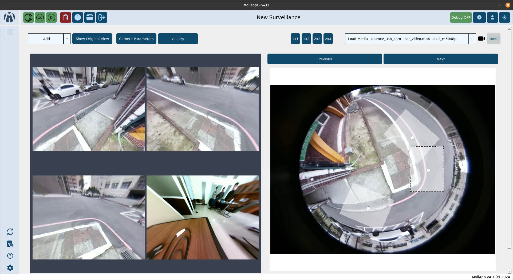
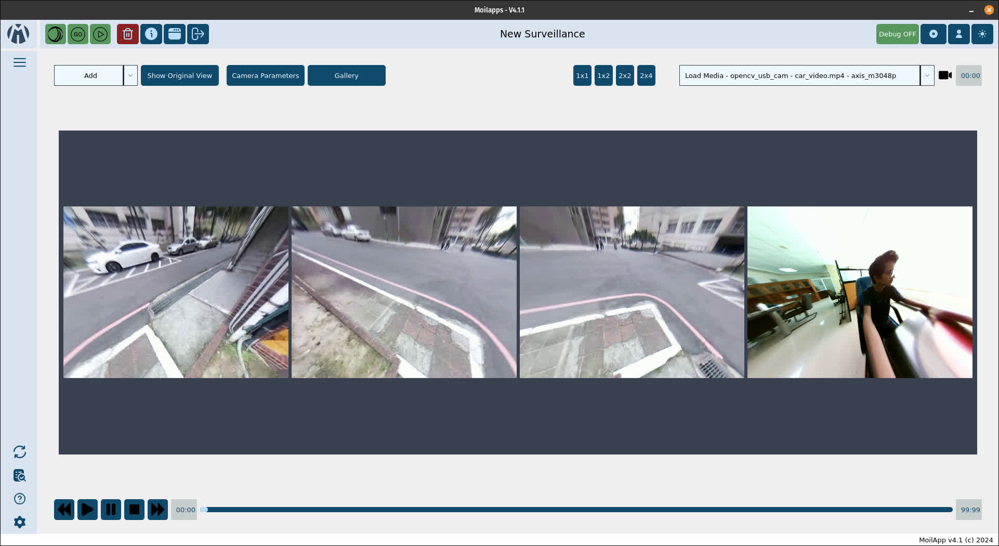
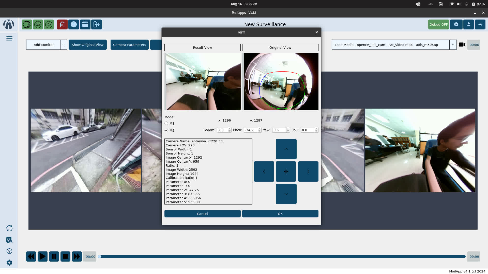
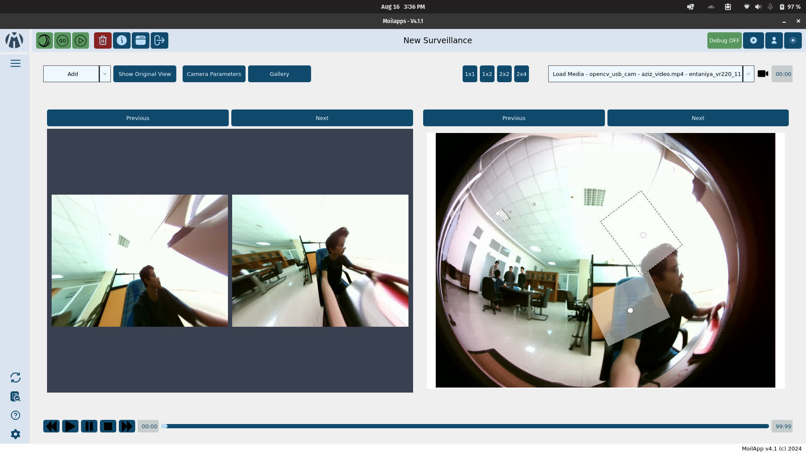

# LTI Surveillance Moilapp Plugin


By Muhammad Hafiz, Basyir Rizki, and Immanuel Eben


## Screenshots






## Description

A plugin for CCTV surveillance, can display multiple views at once in a grid that is adjustable.

Features drag and drop between views, an original view with interactive canvas, and more.

Features to be added:
- FFMPEG-based video recording with lower bitrate for storage efficiency. 
- Video playback
- Functional monitor buttons 

## Usage

```bash
# In Moil App root directory
cd src/plugins
git clone https://github.com/Herusyahputra/moilapp-plugin-surveillance-monitoring

cd ../
python3 main.py
```

### Add Monitor (Rectalinear View)
https://github.com/user-attachments/assets/3cf2a96b-1123-44f0-9995-9ca64430bd9b

### Setup Menu
https://github.com/user-attachments/assets/ee98d92e-740e-4d94-8459-24bc992009d6

### Interactive Canvas (Fisheye View)
https://github.com/user-attachments/assets/e48fa01c-f694-43fc-aa33-7ec05c675a17
